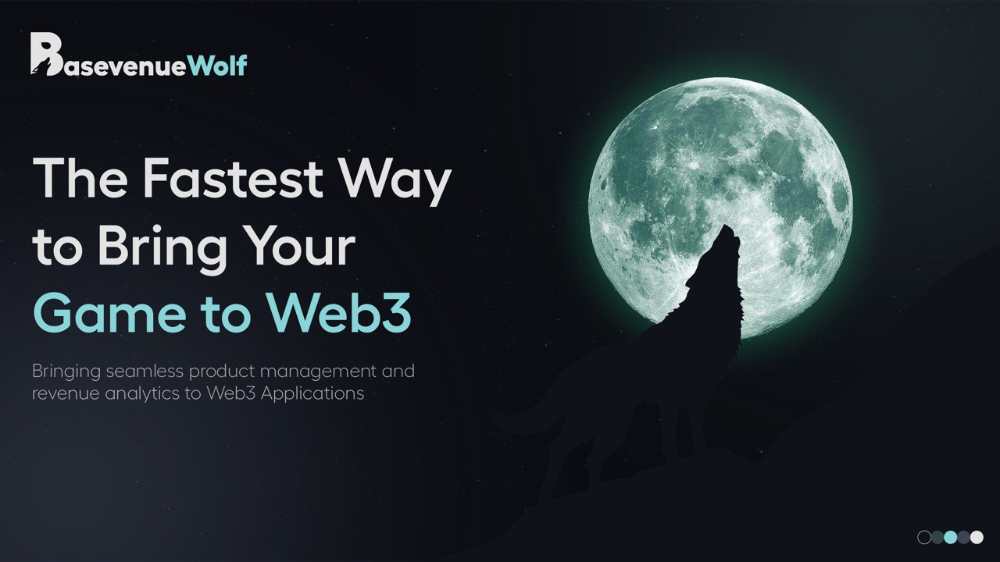
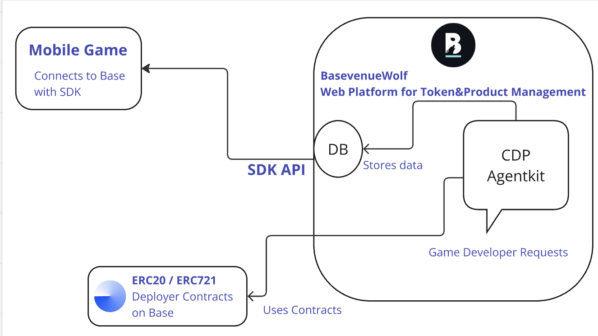

# BasevenueWolf

`ETH Global Agentic 2025`

🚀 BasevenueWolf is the blockchain and AI-powered alternative to [RevenueCat](https://www.revenuecat.com/), bringing seamless, transparent, and trustless product management and revenue analytics to Web3 Applications.

Project is deployed on Base Sepolia Testnet: [https://basevenuewolf.web.app](https://basevenuewolf.web.app/)

### Problems We Solve

Web2 Game developers would like to migrate to Web3 (NFTs, tokens, in-game items, subscriptions, etc.), but handling the migration is complex, expensive and challenging.

1. Development – Web2 developers often lack experience with smart contracts, blockchain SDKs, and decentralized architectures, making it difficult to transition smoothly .

2. Tokeneconomics - Designing sustainable token models, ensuring liquidity, and managing inflationary/deflationary mechanisms require expertise in blockchain economics.

3. Payment Integrations - Enabling seamless crypto and fiat payment options for game users, integrating wallets, and ensuring regulatory compliance can be challenging. (TODO: We will solve this problem with our Paywall Integration feature).

## Repositories

- [Backend & Contracts](https://github.com/berkingurcan/BasevenueWolf)
- [Frontend](https://github.com/batuhanozcan1605/basevenue_wolf)
- [SDK](https://github.com/batuhanozcan1605/basevenuewolf_sdk)

### Team Members

- [Berkin Gürcan](https://github.com/berkingurcan)
- [Batuhan Özcan](https://github.com/batuhanozcan1605)

## Features

- 🤖 AI-powered Game Currency and Game Products management
- 👝 AI Supported Wallet Management (Future Development Idea)
- 💳 Paywall Integration (Future Development Idea)
- 💰 Revenue analytics and tracking(Future Development Idea)
- ⛓️ Cross-chain bridging support(Future Development Idea)
- 📊 Real-time analytics dashboard(Future Development Idea)

## Current Architecture



## AgentKit Usage

- [TokenManagerProvider](./lib/ai-agents/tokenManagerProvider.ts)
AI Agent tool for deploying and managing Main Currency of the Game.

- [ProductManagerProvider](./lib/ai-agents/productManagerProvider.ts)
AI Agent tool for deploying and managing Game Products such as Items, Products etc.

**Note:**
Also opened [PR](https://github.com/coinbase/agentkit/pull/322) for AgentKit repository to add new features.

## Installation

```bash
npm install
```

## How to run

```bash
npm run dev
```

### Prettier

```bash
npm run format
```

## Smart Contracts

BasevenueWolf uses several smart contracts to manage game items, products, and currencies. Here's an overview of the main contracts:

### CustomERC20
A standard ERC20 token implementation that can be used for creating custom game currencies or tokens.
- Inherits from OpenZeppelin's ERC20
- Allows setting custom name, symbol, and initial supply
- Initial supply is minted to a specified owner address

### GameProduct
A specialized ERC20 token designed specifically for game products and in-game currencies.
- Inherits from OpenZeppelin's ERC20
- Similar to CustomERC20 but specifically branded for game products
- Configurable name, symbol, and initial supply
- Initial supply is minted to the game owner's address

### GameItem (ERC721)
An NFT implementation for unique game items and collectibles.
- Inherits from OpenZeppelin's ERC721URIStorage
- Supports metadata through tokenURI
- Features:
  - Custom base URI for metadata
  - Sequential token ID generation
  - Minting function with optional metadata URI
  - Full ERC721 standard compliance

Each contract comes with its corresponding deployer contract (ERC20Deployer, GameProductDeployer, GameItemDeployer) that facilitates easy deployment and management of new token instances.

## Contract Deployment

### Installation
```bash
cd contracts
npm install
```

### Deployment Scripts
The project includes three main deployment scripts:

1. **deploy.ts** - Deploys the ERC20Deployer contract and a sample token
```bash
npx hardhat run scripts/deploy.ts --network custom
```

2. **deploy-game-product.ts** - Deploys the GameProductDeployer and a sample game product
```bash
npx hardhat run scripts/deploy-game-product.ts --network custom
```

3. **deploy-game-item.ts** - Deploys the GameItemDeployer and a sample NFT collection
```bash
npx hardhat run scripts/deploy-game-item.ts --network custom
```

After deployment, the script will output the addresses of the deployed contracts. Make sure to save these addresses for future reference.

## API Documentation

### Health Check API

**Endpoint**: `GET /api/health`

Check the health status of the application.

#### Response

```json
{
  "status": "healthy",
  "timestamp": "2025-02-07T12:00:00Z"
}
```

### Chat

**Endpoint:**
`POST /api/chat`

**Request:**

```json
{
  "messages": [
    {
      "role": "user",
      "content": "Which tools do you have"
    }
  ],
  "userWalletAddress": "0x5e7EC86C282BFF4583C80E5b275fc10246d19dBD"
}
```

or with memory:

```json
{
  "messages": [
    {
      "role": "user",
      "content": "My name is eylül"
    },
    {
      "role": "assistant",
      "content": "Hello eylül! How can I assist you today?"
    },
    {
      "role": "user",
      "content": "What is my name? and which tools do you have"
    }
  ]
}
```

**Response:**

As [ReadableStream](https://developer.mozilla.org/en-US/docs/Web/API/ReadableStream), the response will be streamed to the client.

```json
{
  "content": "I have the following tools: ..."
}
```

### SDK API Documentation

**Endpoint**: `GET /api/sdk`

Retrieve user data from the SDK.

#### Parameters

| Parameter         | Type   | Required | Description                    |
| ----------------- | ------ | -------- | ------------------------------ |
| userWalletAddress | string | Yes      | The wallet address of the user |

#### Example Request

```bash
GET "/api/sdk?userWalletAddress=0x123...abc"
```

#### Success Response

**Code**: 200 OK

Returns the token address of the user

```json
{
  "data": "0x9876543210"
}
```

#### Error Responses

**Code**: 400 BAD REQUEST

```json
{
  "error": "userWalletAddress is required"
}
```

**Code**: 404 NOT FOUND

```json
{
  "error": "User not found"
}
```

**Code**: 500 INTERNAL SERVER ERROR

```json
{
  "error": "Internal server error"
}
```

### Products API

**Endpoint**: `GET /api/sdk/products`

Retrieve all products (ERC20 tokens and ERC721 NFTs) associated with a user's wallet address.

#### Parameters

| Parameter         | Type   | Required | Description                    |
| ----------------- | ------ | -------- | ------------------------------ |
| userWalletAddress | string | Yes      | The wallet address of the user |

#### Example Request

```bash
GET "/api/sdk/products?userWalletAddress=0x123...abc"
```

#### Success Response

**Code**: 200 OK

```json
{
  "success": true,
  "data": {
    "userWalletAddress": "0x123...abc",
    "products": [
      "0xabc...123", // Contract addresses of products
      "0xdef...456"
    ],
    "count": 2
  }
}
```

#### Error Responses

**Code**: 400 BAD REQUEST

```json
{
  "error": "userWalletAddress is required"
}
```

**Code**: 500 INTERNAL SERVER ERROR

```json
{
  "error": "Failed to fetch products"
}
```


